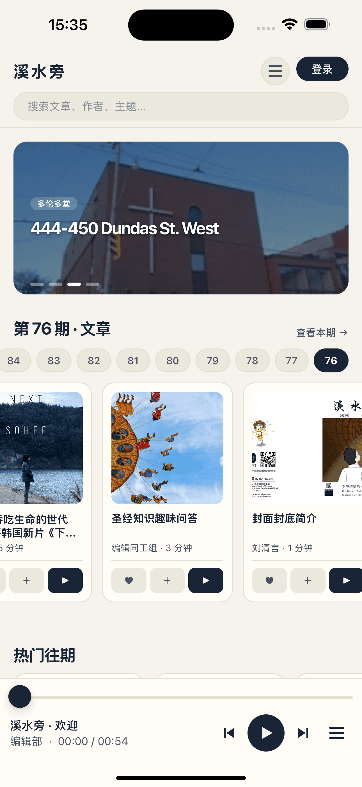
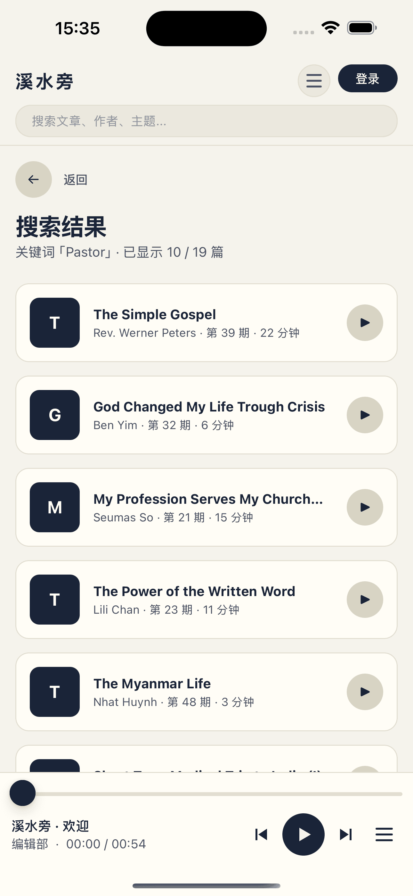
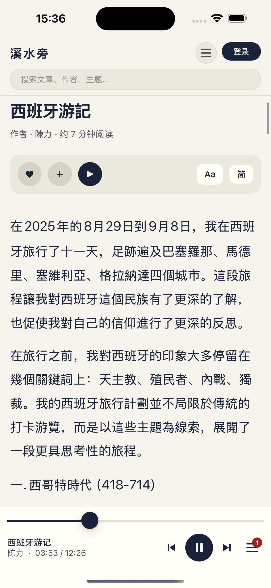
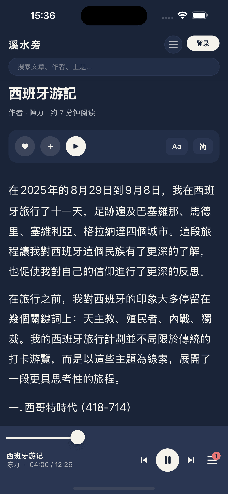
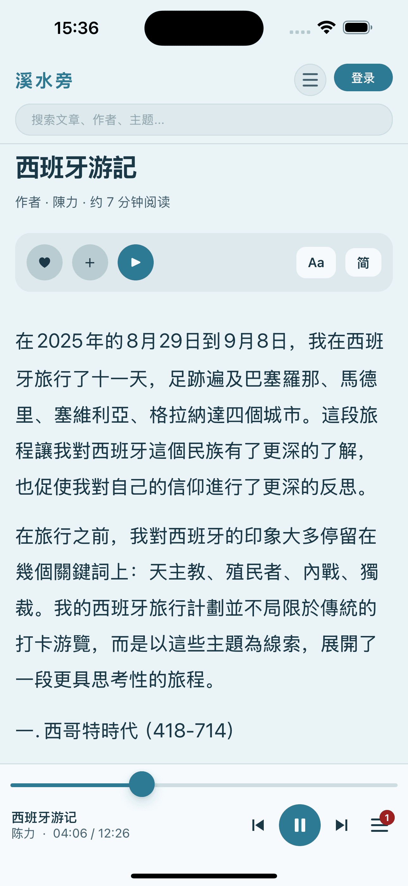
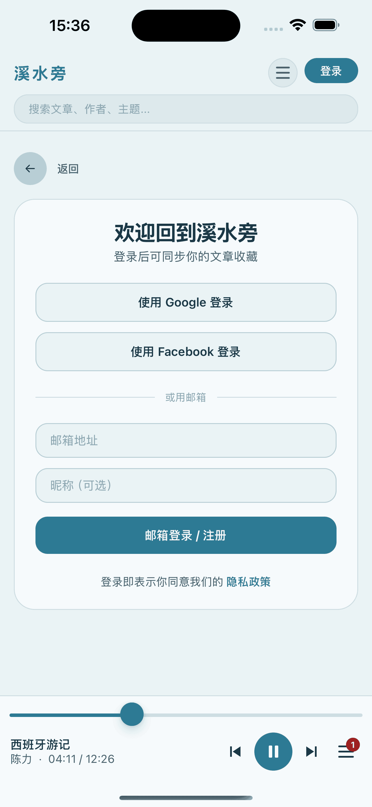
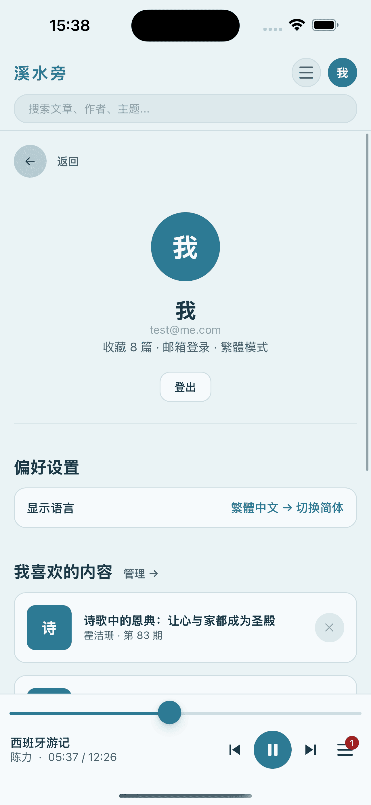
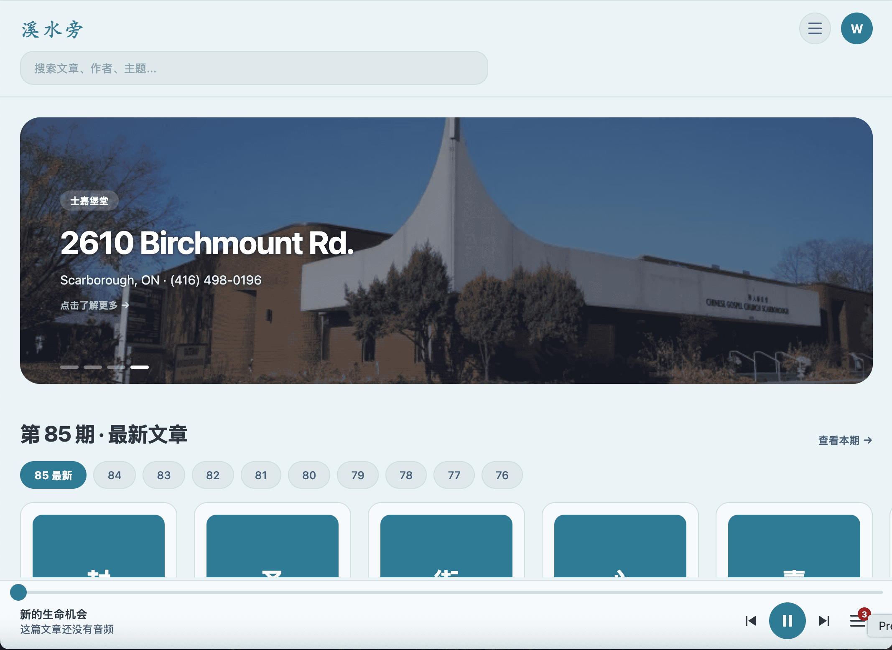
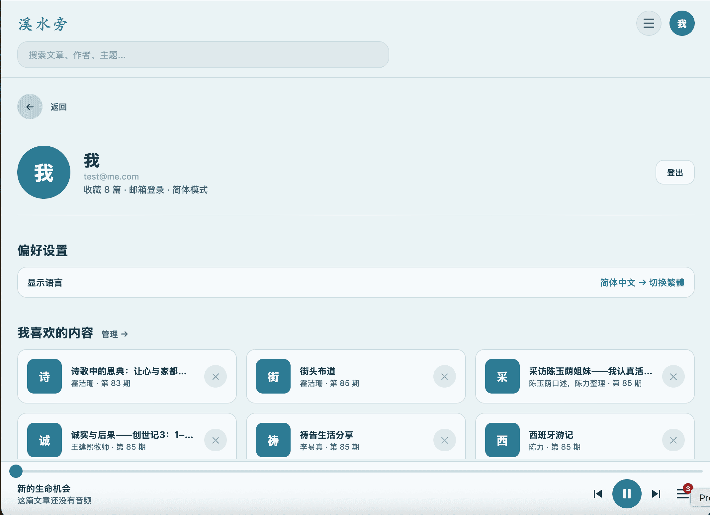

# 溪水旁 2.0

基督教中文季刊「溪水旁」的全平台阅读应用。一套代码覆盖 iOS、Android、Web。

## 应用截图

### iOS
<p align="center">
  
  
  
  
  
  
  
  
</p>

### Web
<p align="center">
  
  
  
</p>

## 技术栈

| 层 | 技术 |
|---|---|
| 前端 | Expo SDK 52 · React Native 0.76.9 · TypeScript |
| 路由 | Expo Router v4（文件即路由） |
| 状态 | Zustand · Apollo Client 3.x（AsyncStorage 持久化） |
| 图片 | expo-image（三平台磁盘缓存）· jsDelivr CDN |
| 音频 | expo-av · @react-native-community/slider |
| 认证 | JWT · Google / Facebook OAuth（expo-auth-session）· **已打通** |
| 后端 | Fastify · Mercurius GraphQL · DataLoader |
| 数据库 | MongoDB Atlas（Xishuipang 库 · Articles / TableOfContents / Users / Favorites / Usage） |
| TTS | MeloTTS-Chinese（本地 Mac M1）/ IndexTTS 1.5（后续用 RTX 5070） |
| 缓存 | 内存缓存（Redis 接口预留）· Apollo cache-first |
| 存储 | 本地 localhost（开发期）/ Cloudflare R2（生产，计划中） |

## 项目结构

```
xishuipang-flat/
├── app/                    # 页面（Expo Router 文件路由）
│   ├── _layout.tsx         # 根布局（ApolloProvider + ThemeProvider + MiniPlayer + bootstrapAuth）
│   ├── index.tsx           # 首页（欢迎卡 + 最新文章 + 推荐 + 播放队列 stack + 收藏 stack + 往期）
│   ├── article/[id].tsx
│   ├── volume/[id].tsx
│   ├── volumes.tsx
│   ├── favorites.tsx
│   ├── search.tsx
│   ├── queue.tsx
│   ├── login.tsx           # 邮箱 + Google + Facebook 三路登录
│   ├── profile.tsx
│   ├── legal.tsx
│   └── privacy.tsx
├── lib/
│   ├── theme/              # 设计系统（7 主题 · brand/onBrand/danger 等完整 token）
│   ├── store/              # Zustand（user + 收藏 + 队列 + 音频播放状态）
│   ├── ui/
│   │   ├── MiniPlayer.tsx  # 底部播放器（expo-av + Slider + 队列徽章 + 欢迎音频 fallback）
│   │   └── ...             # TopNav / ThemeMenu / Skeleton / cards
│   ├── auth/               # OAuth hooks（Google / Facebook，读 EXPO_PUBLIC_* 环境变量）
│   ├── recommend.ts
│   ├── mock/
│   └── graphql/
├── server/                 # 后端（独立 Node 项目）
│   ├── src/
│   │   ├── index.ts        # Fastify 入口（启动时 initAudioState）
│   │   ├── schema.ts
│   │   ├── resolvers.ts    # audioEpisode / audioEpisodes 接 TTS 产物
│   │   ├── audio.ts        # 读 tts/output/state.json，简繁合并，生成 streamUrl
│   │   ├── auth.ts         # JWT + Google/FB token 验证 + upsertOAuthUser
│   │   ├── loaders.ts
│   │   ├── db.ts
│   │   ├── cache.ts
│   │   └── types.ts
│   ├── package.json
│   └── .env.example
├── tts/                    # 本地 TTS 批处理（Python）
│   ├── config.py
│   ├── db.py
│   ├── textproc.py
│   ├── synth.py
│   ├── scripts/
│   │   ├── smoke_test.py
│   │   ├── generate_one.py
│   │   ├── generate_welcome.py
│   │   ├── batch.py
│   │   ├── check.py
│   │   └── serve.py
│   └── output/
│       ├── state.json
│       ├── _welcome.mp3
│       └── volume_XX/*.mp3
├── DESIGN.md
├── streaming.md
└── 工作日志.md
```

## 快速开始

### 0. 环境变量（重要，三个 .env 都不提交 git）

**server/.env**（必填）
```bash
MONGO_URI=mongodb+srv://.../Xishuipang
JWT_SECRET=<随机字符串>
AUDIO_BASE_URL=http://localhost:8090
GOOGLE_CLIENT_IDS=<web-id>,<ios-id>,<android-id>   # 三个逗号分隔
FACEBOOK_APP_ID=<fb-app-id>
FACEBOOK_APP_SECRET=<fb-app-secret>
CORS_ORIGINS=http://localhost:8081,http://localhost:19006
```

**xishuipang-flat/.env**（前端，无 secret）
```bash
EXPO_PUBLIC_GOOGLE_WEB_CLIENT_ID=<web-id>
EXPO_PUBLIC_GOOGLE_IOS_CLIENT_ID=<ios-id>
EXPO_PUBLIC_GOOGLE_ANDROID_CLIENT_ID=<android-id>
EXPO_PUBLIC_FACEBOOK_APP_ID=<fb-app-id>
```

**tts/.env**
```bash
MONGO_URI=mongodb+srv://.../Xishuipang
SPEED=0.9
BITRATE=32k
OUTPUT_SAMPLE_RATE=22050
EN_THRESHOLD=0.7
```

### 1. 启动后端

```bash
cd server
npm install
npm run dev
# ✓ MongoDB connected
# ✓ Audio index loaded: N episodes from .../tts/output/state.json
# 🚀 GraphQL server ready at http://localhost:4000/graphiql
```

### 2. 启动 TTS 静态服务（音频）

```bash
cd tts
conda activate python-mac-gpu
python -m scripts.serve
```

### 3. 启动前端

```bash
cd xishuipang-flat
npm install
npx expo install @react-native-community/slider
npx expo start --clear
# 按 w 打开 Web / 按 i 打开 iOS 模拟器
```

### 4. 验证

- GraphiQL: `http://localhost:4000/graphiql`
- 静态音频: `http://localhost:8090/volume_85/11_li_s.mp3`
- 前端: `http://localhost:8081`

## 核心功能

### 已完成
- **首页**：欢迎卡（未登录）+ 公告轮播 + 期号选择器 + 最新文章滑窗 + 为你推荐 + 播放队列 stack + 收藏 stack + 往期期刊
- **推荐算法**：加权打分 + 同作者多样化 + 未登录热门回落
- **骨架屏**：三段占位，加载不抽搐
- **文章阅读**：首屏 2 张图 high priority + 其余延后挂载 + 字号四档 + 简繁切换
- **期刊详情**：封面图 Hero + Spotify 式 track list
- **全部期刊**：封面网格 + 最新/最早排序
- **全文搜索**：MongoDB `$text` + infinite scroll
- **用户系统（2026/4/21 全线打通）**：
  - JWT 登录 + bootstrapAuth 自动恢复
  - Google OAuth 三平台 Client ID（Web / iOS / Android）完整配置
  - Facebook OAuth App ID + Redirect URI + email permission 配置完成
  - 账号合并：同一邮箱的 Google/FB 登录自动绑定到同一 User（`upsertOAuthUser` 按 email 匹配）
  - 当前发布状态：Google consent screen `Testing`；FB `Unpublished`。开发期都只允许 test user / admin 登录
- **文章收藏云同步**：MongoDB `Favorites` 集合，登出清本地
- **音频收藏本地**：AsyncStorage
- **播放队列**：+ 加入 / ▶ 播放 / ↑↓ 排序 / ✕ 删除 / 徽章显示数量
- **音频播放**：
  - 本地 TTS 批处理（MeloTTS-Chinese，M1 Pro CPU 5x 实时）
  - 后端 `audio.ts` 读 `tts/output/state.json` + 简繁 slug 归并（_t → _s）
  - `scripts/serve.py` HTTP Range 服务（拖动进度可从中间加载）
  - 前端 MiniPlayer：expo-av 实际播放 + Slider 拖动 + 队列徽章 + 欢迎音频 fallback
  - 主题配色统一：按钮 `theme.brand` + 图标 `theme.onBrand` + 队列徽章 `theme.danger`
- **7 主题**：暖白 / 深色 / 护眼 / 春 / 夏 / 秋 / 冬
- **Mini Player**：底部固定，theme 统一配色
- **欢迎音频**：未登录用户进首页自动在 MiniPlayer 加载"溪水旁·欢迎"（两段诗篇引用 + 编辑部致谢）

### 待做
- **OAuth App Review**：上线前 Google（External → Production）+ Facebook（App Review）都要过审，要写隐私政策、数据用途说明
- **TTS 升级**：换到 Windows RTX 5070 笔记本 + **IndexTTS 1.5**（Bilibili 开源，标准普通话）
- **音频全量**：目前只生成了 demo 两篇（11_li_s + _welcome），全量 1352 篇待 RTX 5070 上跑
- **音频部署**：跑完全量 → 传 **Cloudflare R2**（10GB 免费 + 零出站费）→ `AUDIO_BASE_URL` 一行改完
- **服务器部署**：Heroku / Railway / Fly（待定）
- **播放队列拖拽排序**（Reanimated + Gesture Handler）
- Redis 缓存接入（配 REDIS_URL 即切换）
- GraphQL codegen

## OAuth 配置（开发期要点）

### Google Cloud Console

- 项目：`xishuipang`（新建一个）
- OAuth consent screen：External + app name "溪水旁" + 测试用户加自己 Gmail
- 三个 Client 都要建：
  - **Web**：JS origins `http://localhost:8081` + `http://localhost:19006` + `https://auth.expo.io`；Redirect URIs `http://localhost:8081` + `https://auth.expo.io/@<expo-username>/xishuipang`
  - **iOS**：Bundle ID `com.xishuipang.app`
  - **Android**：Package `com.xishuipang.app` + SHA-1（由 `~/.android/debug.keystore` 生成，开发 keystore 没有就 `keytool -genkey` 造一个）

### Facebook Developers

- App 类型：Consumer + Facebook Login use case
- Basic → App Domains 加 `auth.expo.io` + Privacy Policy URL（可填 `https://www.xishuipang.com` 占位）
- Facebook Login → Settings → Valid OAuth Redirect URIs 填 `https://auth.expo.io/@<expo-username>/xishuipang`
- Facebook Login → Permissions 主动勾选 `email`（默认没勾会报 `Invalid Scopes: email`）

### 账号合并

`server/src/auth.ts` 的 `upsertOAuthUser` 逻辑：
1. 优先按 `(provider, providerId)` 精确匹配
2. 未命中则按 **email 匹配** 已有 User
3. 若匹配到则把新 providerId 绑定到该 User
4. 全未命中则创建新 User

效果：先 Google 登录再 FB 登录（同邮箱）会登进同一个账号，收藏/偏好无缝共享。

## 音频系统

### 架构

```
┌─────────────────────────────────────────────┐
│ Expo App                                    │
└────────┬──────────────────────┬─────────────┘
         │ GraphQL :4000        │ HTTP Range :8090
         ▼                      ▼
┌──────────────────┐    ┌────────────────────┐
│ Fastify          │    │ scripts/serve.py   │
│ audioEpisode(id) │    │ (开发期)           │
│ → streamUrl      │    │                    │
│                  │    │ or Cloudflare R2   │
│ state.json 读取  │    │ (生产期)           │
│ _t → _s 归并     │    └────────────────────┘
└──────────────────┘              ▲
                                  │
                  ┌───────────────┴───────────────┐
                  │ tts/output/volume_XX/*.mp3    │
                  │ (本地生成,简繁共用)            │
                  └───────────────────────────────┘
```

**数据流**：App → GraphQL :4000 拿 streamUrl → 直接向 :8090 / R2 请求 mp3 字节流（expo-av 播放 + Slider 拖动）。

### TTS 配置

- 模型：MeloTTS-Chinese（VITS）
- 码率：32 kbps MP3 + 22.05 kHz + 单声道
- 语速：0.9
- 简繁共用：只生成 `_s`，resolver 里 `_t → _s` 映射
- 断点续传：`output/state.json` 记录进度

### 生产升级

未来换到 Windows RTX 5070 + IndexTTS 1.5：
- Bilibili 开源，中文优化，标准普通话
- 零样本音色克隆
- PyTorch 2.9.1+cu128（Blackwell sm_120 支持）
- 预估全量 1352 篇 2-5 小时跑完（Mac M1 要 30-40 小时）

### 存储

选 Cloudflare R2：10GB 免费 + 零出站费，2.5GB 音频完全在免费档内。

## GraphQL API

```graphql
# 文章
{ latestVolume }
{ articlesByVolume(volume: 85, character: "simplified") { title author firstImage } }
{ article(volume: 85, slug: "0_prayer_s") { title content firstImage } }
{ volumes(offset: 0, limit: 6) { id subtitle count coverImage } }
{ search(query: "祷告", limit: 10, offset: 0) { total articles { title } } }

# 认证(三路都已打通)
mutation { loginOrRegister(email: "x@y.com") { token user { id email } } }
mutation { loginWithGoogle(idToken: "...") { token user { id email provider } } }
mutation { loginWithFacebook(accessToken: "...") { token user { id email provider } } }
{ me { id email name provider } }

# 文章收藏
mutation { addFavorite(articleId: "85:0_prayer_s", title: "...", author: "...") { id } }
{ myFavorites { id articleId volume title author createdAt } }

# 音频
{ audioEpisode(id: "85:11_li_s") { streamUrl durationSeconds title author } }
{ audioEpisodes(volume: 85) { id title streamUrl durationSeconds } }
```

## MongoDB 集合

| 集合 | 用途 | 关键索引 |
|---|---|---|
| `Articles` | 文章正文 | `{ title: "text", content: "text" }` |
| `TableOfContents` | 期刊目录 | `{ volume, character }` |
| `Users` | 用户 | `{ provider, providerId }` unique · `{ email }` sparse |
| `Favorites` | 文章收藏 | `{ userId, articleId }` unique · `{ userId, createdAt: -1 }` |
| `Usage` | 阅读行为 | — |

## 路径映射

| 路由 | 页面 | 数据源 |
|---|---|---|
| `/` | 首页 | GraphQL + 欢迎卡 + 推荐 + 队列/收藏 stack |
| `/volume/:id` | 期刊详情 | GraphQL |
| `/article/:id` | 文章阅读 | GraphQL |
| `/queue` | 播放队列 | Zustand |
| `/volumes` | 全部期刊 | GraphQL |
| `/favorites` | 管理收藏 | Zustand（云同步） |
| `/search?q=` | 搜索 | GraphQL（分页） |
| `/login` | 登录 | Email / Google / Facebook |
| `/profile` | 用户中心 | Zustand |
| `/legal` | 法律声明 | 静态 |
| `/privacy` | Privacy Policy | 静态 |

## 版权

多伦多华人福音堂
© 2005–2026 Chinese Gospel Church of Toronto
www.xishuipang.com · cgc_pen@yahoo.com
